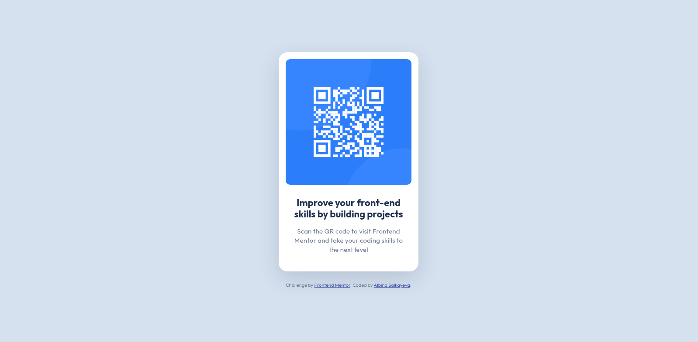

# Frontend Mentor - QR code component solution

This is a solution to the [QR code component challenge on Frontend Mentor](https://www.frontendmentor.io/challenges/qr-code-component-iux_sIO_H). Frontend Mentor challenges help you improve your coding skills by building realistic projects. 

After a break from learning frontend development, I started with this first challenge again.

## Table of contents

- [Overview](#overview)
  - [Screenshots](#screenshots)
  - [Links](#links)
- [My process](#my-process)
  - [Built with](#built-with)
  - [What I learned](#what-i-learned)
- [Author](#author)

## Overview

### Screenshots

| Desktop | Mobile |
|-|-|
|  |  |

### Links

- Solution URL: [github.com/albina0104/qr-code-component-2](https://github.com/albina0104/qr-code-component-2)
- Live Site URL: [albina0104.github.io/qr-code-component-2/](https://albina0104.github.io/qr-code-component-2/)

## My process

### Built with

- Semantic HTML5 markup
- CSS custom properties
- Flexbox

### What I learned

When I used `height` to make it possible to center an element vertically with flexbox, there was an issue on a small mobile screen - the content was cropped when it overflowed the screen.

To solve it, I used `min-height` instead. This way the height can be taller than the viewport, and this allows the content to be scrolled.

```css
body {
  display: flex;
  flex-direction: column;
  justify-content: center;
  align-items: center;
  min-height: 100vh;
  min-height: 100dvh;
  background-color: var(--slate-300);
}
```

## Author

- Frontend Mentor - [@albina0104](https://www.frontendmentor.io/profile/albina0104)
- GitHub - [albina0104](https://github.com/albina0104)
